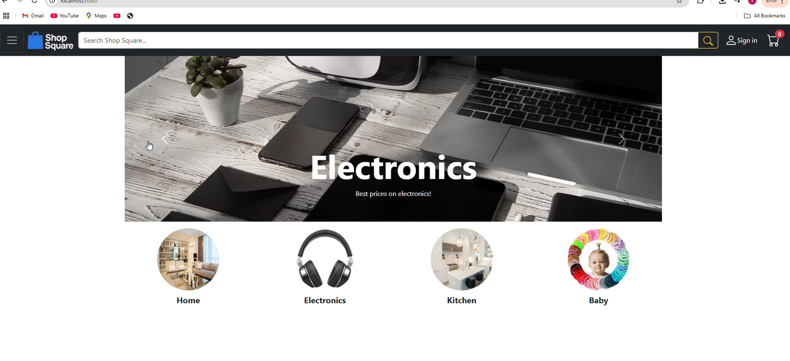
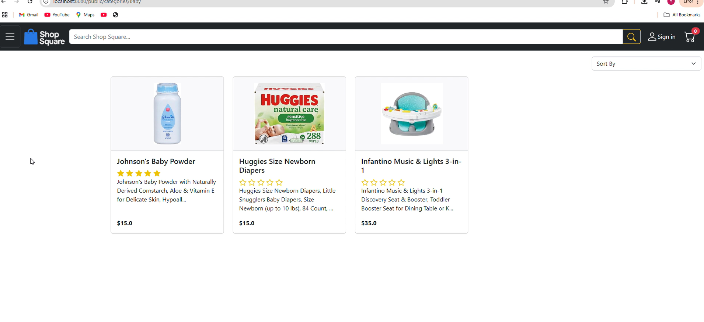
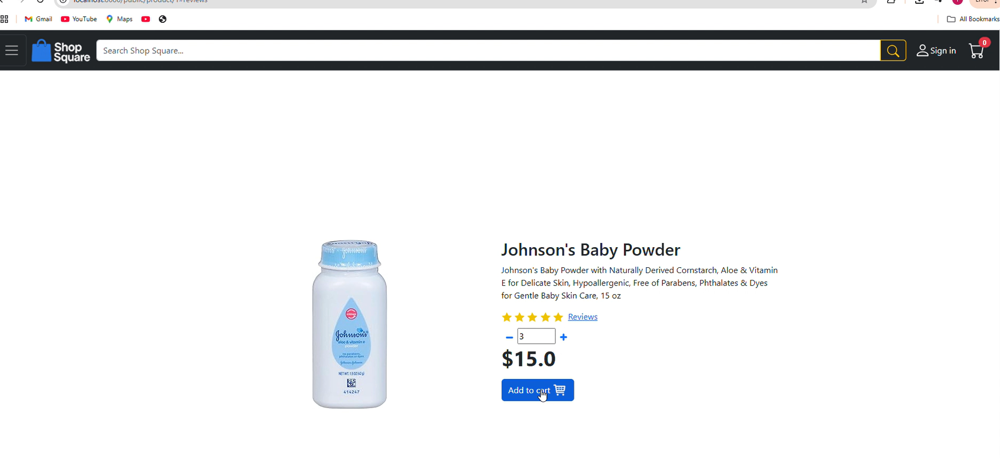
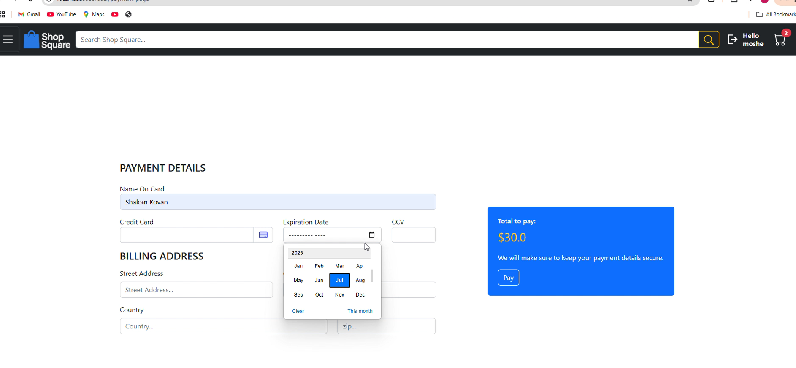

# Online Store E-Commerce Project

## Overview
This is a full-stack e-commerce web application built with Java Spring Boot and Thymeleaf. It allows users to browse products, manage a shopping cart, register and log in, and complete purchases. Admin features include product and category management, and order tracking.

**This project is for educational purposes only. Project creator: Yosef Kovan.**

## Features
- User registration, login, and authentication (Spring Security)
- Product catalog with categories
- Product details and reviews
- Shopping cart and checkout flow
- Order history for users
- Admin dashboard for managing products, categories, and orders
- Responsive UI with Thymeleaf templates
- Custom JavaScript and CSS for enhanced interactivity

## Tech Stack
- **Backend:** Java 21, Spring Boot 3.5.0, Spring Data JPA, Spring Security
- **Frontend:** Thymeleaf, HTML, CSS, JavaScript
- **Database:** MySQL (can be run using XAMPP)
- **Build Tool:** Maven

## Screenshots

### Landing Page


### Products Page


### Product Details Page


### Payment/Checkout Page


## Getting Started

**Note:** XAMPP was used to run the MySQL server for this project. You can use XAMPP to easily start MySQL and import the provided `ex4` database file to view the sample data. Use phpMyAdmin (included with XAMPP) or any MySQL GUI to import the database file—no command line required.

- To log in as an admin, use:
  - **Email:** admin@gmail.com
  - **Password:** Test@2025
  (This is not real info, just for the project.)

- The project was developed and run using **IntelliJ IDEA**. Open the project in IntelliJ and run the main application class to start the server.

### Prerequisites
- Java 21+
- IntelliJ IDEA (or any compatible IDE)
- XAMPP (for MySQL server and phpMyAdmin)

## Directory Structure
```
├── images/                        # Website screenshots for documentation
├── src/
│   └── main/
│       ├── java/                  # Java source code (controllers, services, models)
│       ├── resources/
│       │   ├── static/
│       │   │   ├── css/           # Custom CSS
│       │   │   ├── js/            # Custom JavaScript
│       │   │   └── img/           # Static images and logos
│       │   ├── templates/         # Thymeleaf HTML templates
│       │   └── application.properties # App configuration
├── ex4 .sql                       # MySQL schema and sample data
├── pom.xml                        # Maven build file
└── README.md                      # Project documentation
```

## Customization
- **Static Assets:** Place additional images in `src/main/resources/static/img`.
- **Templates:** Modify HTML in `src/main/resources/templates` for UI changes.
- **JS/CSS:** Update or add files in `src/main/resources/static/js` and `src/main/resources/static/css`.

## License
This project is for educational purposes only. Project creator: Yosef Kovan.

